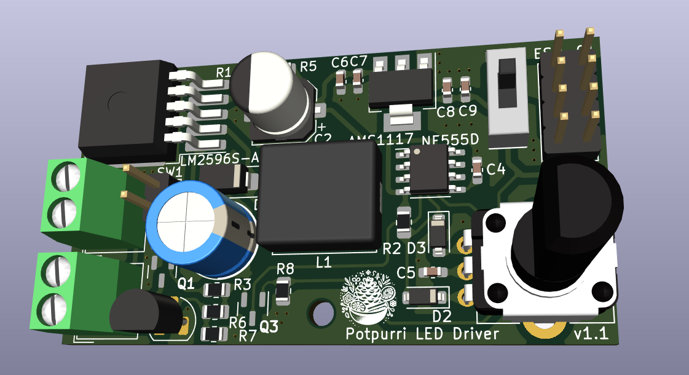
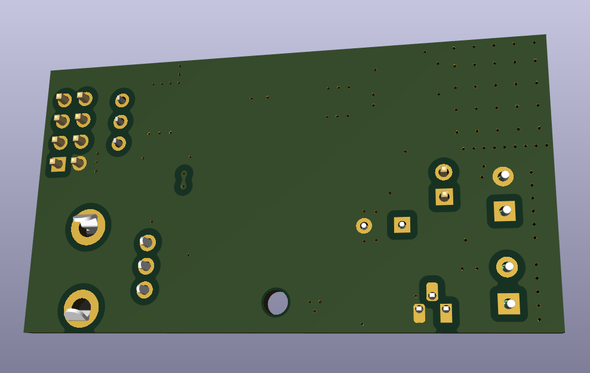
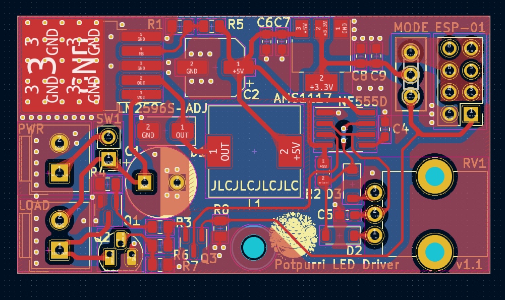

# LED Driver Board

This PCB is designed drive and dim the LED light in my hallway. It uses a LM2596 to step down the voltage from the  LED light adapter to dirve the circuit. The board also has a AMS1117-3.3 to step down the voltage to 3.3 V to be able to have an ESP-01 to turn on/off the LEDS.

## Images

### Schematic

### 3D Renderings
- Front View: 
- Back View: 

### PCB
**2-Layer Stackup**: Signal Layer, GND Layer
- All layers: 